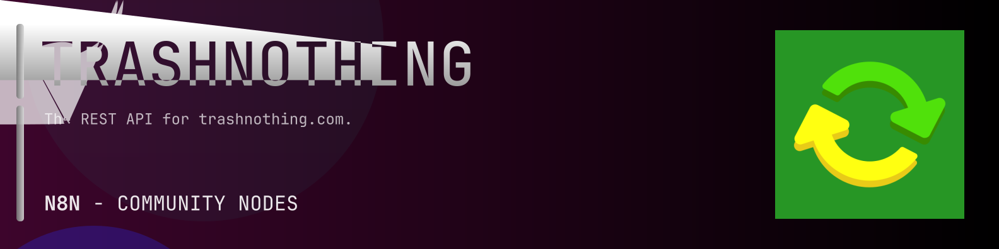

# @n8n-dev/n8n-nodes-trashnothing



[](https://www.npmjs.com/package/@n8n-dev/n8n-nodes-trashnothing)
[](https://opensource.org/licenses/MIT)

---

**Stop writing trashnothing API integrations by hand.**

Every time you connect n8n to trashnothing, you waste hours mapping endpoints, defining parameters, and debugging schemas. You copy-paste from docs, fix edge cases, and pray nothing breaks.

**What if connecting n8n to trashnothing took 5 minutes, not half a day?**

This node gives you **7+ resources** out of the box: **Users**, **Posts**, **Groups**, **Photos**, **Messages**, and 2 more: with full CRUD operations, typed parameters, and zero manual configuration.

---

## What You Get

- **Zero boilerplate**: Resources, operations, and fields are pre-configured and ready to use
- **Full CRUD**: Create, read, update, and delete support where the API allows it
- **Typed parameters**: No more guessing field types
- **Built-in auth**: API key authentication, ready to go
- **Declarative**: Native n8n performance, no custom execute() overhead

---

## Install

```bash
npm install @n8n-dev/n8n-nodes-trashnothing
```

**Or in n8n:**
1. **Settings → Community Nodes → Install**
2. Search: `@n8n-dev/n8n-nodes-trashnothing`
3. Click **Install**

---

## Quick Start

1. Install the node (above)
2. Add credentials: **trashnothing API** → paste your API key
3. Drag the **trashnothing** node into your workflow
4. Pick a resource → pick an operation → done.

That's it. No configuration files. No code. It just works.

---

## Resources

| Resource | Operations |
|----------|------------|
| Users | Get retrieve current user, Put update current user, Get list current users email alerts, Put create an email alert, Delete an email alert, Post change email address, Put set users email address as not bouncing, Get list current users groups, Put update location, Get list current users group notices, Get list current users post locations, Put save a post location for the current user, Get list current users posts, Get search current users posts, Post set a profile image, Get list current users profile images, Post resend account verification email, Post send password reset email, Post report a user, Get retrieve a user, Get retrieve user display info, Delete remove feedback on a user, Post submit feedback on a user, Get list posts by a user, Get search posts by a user, Get retrieve a users profile image |
| Posts | Get list posts, Post submit a post, Get list all posts, Get list all post changes, Get retrieve multiple posts, Get search posts, Delete a post, Get retrieve a post, Put update a post, Delete a post bookmark, Put bookmark a post, Get retrieve post display data, Put promise an offer post, Post reply to a post, Post report a post, Put satisfy a post, Post share a post, Put unpromise an offer post, Put withdraw a post |
| Groups | Get search groups, Get retrieve multiple groups, Post join groups, Get retrieve a group, Post submit group answers, Post contact group moderators, Post leave a group |
| Photos | Post create a photo, Get retrieve multiple photos, Delete a photo, Post rotate a photo |
| Messages | Get list conversations, Put archive all conversations, Put mark all conversations as read, Get search conversations, Delete conversation, Put archive conversation, Put block conversation, Put mark conversation as read, Get list conversation messages, Post reply to conversation, Post report conversation, Put unarchive conversation, Put unblock conversation |
| Stories | Get list stories, Post submit a story, Get retrieve a story, Put like a story, Put unlike a story, Post record story viewed |
| Misc | Post send feedback |

---

## Why This Node?

**Without this node:**
- Hours of manual API integration
- Copy-pasting from trashnothing docs
- Debugging auth, pagination, error handling
- Maintaining your own client code

**With this node:**
- Install → configure → use. 5 minutes.
- Auto-generated from the official trashnothing OpenAPI spec
- Always up to date when the API changes
- Native n8n performance

---

## Auto-Generated
This node was auto-generated from the official **trashnothing** OpenAPI specification using
[@n8n-dev/n8n-openapi-node-ultimate](https://github.com/kelvinzer0/n8n-openapi-node-ultimate),
then validated against the live API so you get accurate types and real parameters, not guesswork.

When the trashnothing API updates, this node updates too.

---

## Support This Project

If this node saved you hours of work, consider supporting continued development, new APIs, better error handling, and faster updates.

[](https://n8n-code.github.io/membership/#/eyJ0aXRsZSI6IktlZXAgSXQgTW92aW5nIiwiZGVzYyI6Ik9uZSBkZXZlbG9wZXIgYnVpbHQgYSB0b29sIHRoYXQgYXV0by1nZW5lcmF0ZXNcbm44biBub2RlcyBmcm9tIGFueSBPcGVuQVBJIHNwZWMuXG5cbllvdXIgZG9uYXRpb24gZnVuZHMgbmV3IGZlYXR1cmVzLCBtb3JlIEFQSSBzdXBwb3J0LFxuYW5kIGJldHRlciB0b29saW5nIGZvciBldmVyeSBkZXZlbG9wZXIgYWZ0ZXIgeW91LiIsInRhcmdldCI6NTAwMCwiYWRkcmVzc2VzIjp7ImV0aGVyZXVtIjoiMHhmMDU1NWQ0MGRiRkI0ZTNCZjA3MDQ0MjgyQjc4RjJmRTFmNTFFZjcyIiwic29sYW5hIjoiNlpEVk5BYmpZZExEcXo4cGt3VUNHYllaNVV3QlFranB0QzU1Wk5vTFcybVUifSwiZGlzY29yZCI6Imh0dHBzOi8vZGlzY29yZC5nZy9wdERaOGU0aDkzIn0)

---

## License

MIT © [kelvinzer0](https://github.com/n8n-code)
